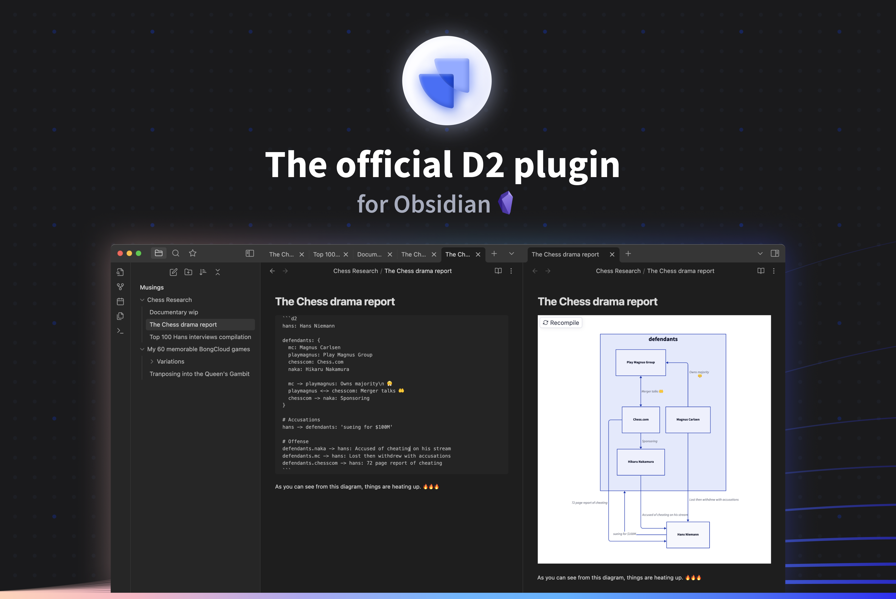

<div align="center">
  
  <h2>
    D2 Obsidian Plugin
  </h2>

D2 is a modern diagram scripting language thats turns text to diagrams. The source code for D2, as well as install instructions and all other information, can be found at
[https://github.com/terrastruct/d2](https://github.com/terrastruct/d2).

[](https://github.com/terrastruct/d2-obsidian/actions/workflows/ci.yml)
[](https://github.com/terrastruct/d2-obsidian/actions/workflows/daily.yml)
[](./LICENSE.txt)
[](https://discord.gg/NF6X8K4eDq)

https://user-images.githubusercontent.com/6413609/205414613-5b2559f1-0645-4432-bb7b-d980de527201.mp4

</div>

## Installation

Settings > Community plugins > Browse > Search for "D2"

**important**: [D2](https://github.com/terrastruct/d2) must be installed for this plugin to work currently. We will later on introduce a remote API as an option, but currently this plugin calls your local installation of D2.

## Configurations

- `Layout engine`: D2 supports multiple layout engines, which can significantly affect the look of your diagram.
- `Theme ID`: For a list of available themes, visit the [D2 repository](https://github.com/terrastruct/d2/tree/master/d2themes).
- `Pad`: Number of pixels padded around the rendered diagram.
- `Sketch mode`: Render the diagram to look like it was sketched by hand.
- `Debounce`: Number of milliseconds to wait after a change has made to refresh the diagram (min 100).
- `Path`: Customize the path to `d2` (optional). We check common places D2 might be installed, along with your system path. However, your OS or setup may require you to input your path to `d2` manually. To do so, type `where d2` into your terminal, and copy everything in the path up until `/d2` and paste it into this configuration.

## Usage

Create a fenced codeblock with `d2` as the language tag:

```d2
Hello -> World
```

## How to run this plugin locally

- Clone this repo.
- Run `yarn` to install dependencies.
- Run `yarn run dev` to start compilation in watch mode.
- Copy over `main.js`, `styles.css`, `manifest.json` to your vault `[VaultFolder]/.obsidian/plugins/d2/`.

## FAQ

- I have D2 installed but I'm running into `D2 Compilation Error: d2: command not found`
  - The Obsidian plugin may not be able to locate your D2 installation. Get the path to the D2 installation by executing `where d2` in the command line, then copying that path minus the executable itself into the `Path` plugin setting (so if the path is `/usr/local/bin/d2`, then you want to copy `/usr/local/bin`).
- I have a question or need help.
  - The best way to get help is to ask on [D2 Discord](https://discord.gg/NF6X8K4eDq).
- I'd like to contribute.
  - We welcome contributions! Please pick one from an existing Issue, or open one if none exists.
- I have a feature request, proposal, or bug report.
  - Please open up a Github Issue. If it's D2-specific, please open it in the [D2 repository](https://github.com/terrastruct/d2). If it's specific to this plugin, please open it here.
- I have a private inquiry.
  - Please reach out at [hi@d2lang.com](hi@d2lang.com).
